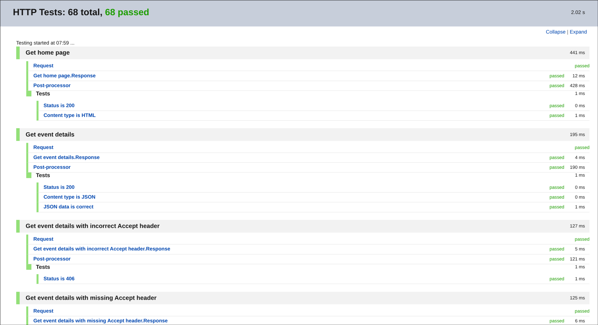
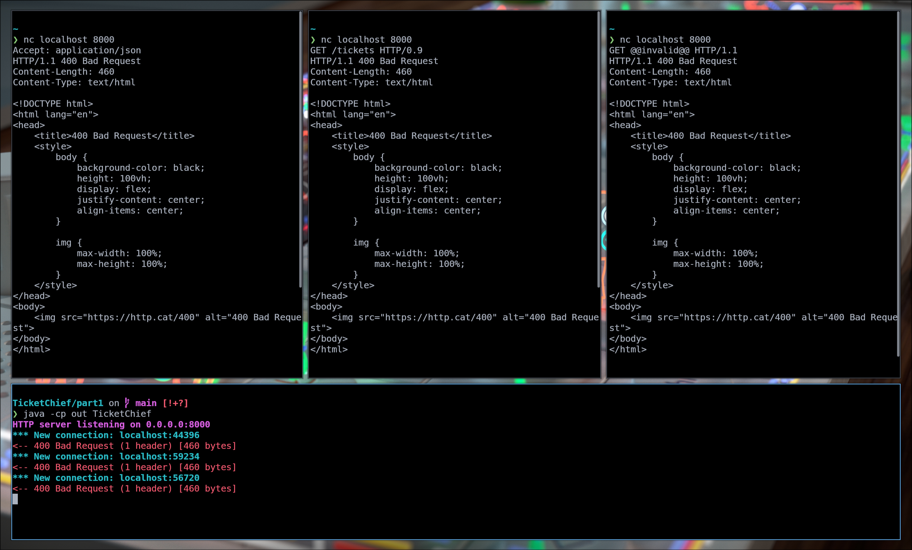



# Overview

This assignment is an advanced exercise in understanding and implementing the fundamentals of the HTTP protocol, as well developing an understanding of low-level full-stack web development and how to design efficient and robust communications systems between frontend clients and backend servers. This was successfully accomplished, with a fully functional implementation of a mock ticket sales platform.

# Design

(Hi marker! I'm running on my second consecutive all-nighter trying to finish off this late coursework once and for all, so I apologise in advance for the absolute behemoth textwall below and hope that it's coherent enough for you to make sense of. Also please don't tell me if I've accidentally left a todo message somewhere because I will probably cry.)

## Part 1

### Backend

The backend server is designed around the `HTTPServer` class at its core. This class handles the lifetime of the server including initialising and closing TCP socket connections, and dispatches all incoming requests to the relevant methods for further handling. The design of this implementation drew inspiration from libraries such as Express.js[^1], with a routing API which allows for pattern-matching incoming HTTP requests.

[^1]: https://expressjs.com/

The `Request` class ingests the deserialised data within the received HTTP request (parsed by `HTTPServer.parseHeaders()` and `HTTPServer.parseBody()`). This is then passed to `HTTPServer.routeRequest()`, where the request is dispatched to the correct route handler. A cascading matching algorithm is used, where the order of defined routes is significant, and the first match handles the request and provides a response. If at any stage a parsing error is encountered during deserialisation, a `BadRequestException` is thrown, then gracefully handled at a higher level in `HTTPServer.handleClient()` and an HTTP 400 response is sent to the client, terminating all further processing.

The `Route` class declares the HTTP method to match, as well as the request path. Route parameters can be declared using a colon syntax (e.g. `/route/:id`), where HTTP requests matching the pattern (e.g. `/route/foo`) will be captured and destructured, and added to the request instance. The route parameter can then be accessed with `Request.getRouteParam()`, allowing for an idiomatic developer API for dynamic routes.

When a route is matched, a callback function is called, which takes the parsed HTTP request (as a `Request` instance), now populated with any relevant route parameters. This callback function must return a `Response` instance, containing all the necessary parameters (status code, headers, and body) for rendering the HTTP response message. If a value of null is returned instead, the server continues to match subsequent routes, allowing for futher cascading.

The `Response` class handles the conversion of response data into an RFC 9112 compliant syntax. It also contains a map of common HTTP status codes to human-readable messages, as well as an alternate `Response.HttpCatResponse()` constructor for when the status code is significant but the headers and body are not. A simple HTML template which shows a fun cat photo with the HTTP status as a caption is returned, as an Easter egg for the end user. When the response is rendered to HTML, the `Content-Length` header is dynamically computed based on the size of the body in raw bytes (to ensure compatibility with multibyte UTF-8 / Unicode symbols).

An event-driven architecture was used in the `HTTPServer` class which draws inspiration from various Python API wrappers (e.g. discord.py[^2]). This is reflected in the `onReady()`, `onConnect()`, `onRequest()` and `onResponse()` methods, with default values providing pretty logging functionality by default. The ANSI colour codes for colourful logging are provided in the `ANSI` class, copied and modified from StackOverflow (instead of manual enumeration). The `defaultRoute()` and `errorRoute()` also set default responses to the client if an incoming request has no matching routes or was interrupted by a server error respectively. All these methods are defined with the `protected` modifier such that they can be overridden by a subclass if event-hook-like behaviour is desired.

[^2]: https://discordpy.readthedocs.io/en/stable/

The `events` package handles backend concert state. The `PurchaseManager` class provides the API for the route callbacks to perform actions such as getting event information (serialised into the `Event` class) or requesting a new purchase. The `requestPurchase()` creates a new `PurchaseRequest` instance containing information about the user's request (i.e. the number of tickets to buy, and the chosen concert in Part 2). The mock latency for adding requests to the ticket queue, as well as consuming the requests on the queue, was implemented by two threads to avoid blocking the main thread and causing the web server to be unresponsive to new requests. A `ConcurrentLinkedQueue()` instance was used for lock-free, thread-safe queue access.

A `RequestEnqueuer` thread is instantiated for every purchase request, sleeping for a random interval before adding the purchase request to the end of the queue. Logging is implemented to keep track of the thread's current state. A single `PaymentProcessor` thread is instantiated upon initialisation of the `PurchaseManager` class, which waits for the queue to be populated, sleeps for a random amount as a mock for handling a financial transaction, then fulfils the user's purchase request with a reference to the `PurchaseManager` instance.

The `PurchaseManager.fulfilPurchase()` method is responsible for allocating tickets to the customer after the "payment" is complete. If there are not enough tickets available (i.e. the tickets got sold out while waiting in the queue), a best-effort attempt is made, selling as many tickets as possible to the end user. Ticket IDs are issued by the `Event.sellTickets()` method, and are generated as random UUID strings. This approach was taken over using an autoincrementing / sequential ID system as it makes others' ticket IDs unguessable.

JSON parsing was handled using hard-coded regular expressions, to avoid having to implement a full standards-compliant JSON parser (outwith the scope of this assignment's learning intention) or using an external third-party parsing library (disallowed by the specification). This is not the most robust approach as it does not handle e.g. escaped character sequences correctly, nor does it support arbitrary ordering of JSON keys, but it is sufficient for this assignment as we are implementing the client and thus have control over its implementation. JSON responses were simpler, using Java string formatting functionality to fill in values into a JSON string template.

Finally, the `TicketChief` entrypoint class brings it all together, reading the `cs2003-C3.properties` and `tickets.json` files, initialising the HTTP server, and registering the routes for the Ticket Chief API. The `utils.PropertiesReader` helper class is used for parsing the properties file, providing sensible default values for omitted or invalid properties, as well as simple type conversion. Blank lines and comment lines (beginning with `#`) are skipped during parsing.

### Endpoints

#### `GET /tickets`

This endpoint is implemented as per the specification, with a couple of notes:
- An additional response of HTTP 406 (Not Acceptable) is used if the client omits or specifies an incompatible MIME type in the `Accept` header.
- String length validation is intentionally omitted as the concert data is static and immutable, all provided events are compliant, and truncation is undesirable. The maximum string length in the specification is interpreted as being an input constraint/precondition.

#### `POST /queue`

As above, an HTTP 406 response is sent on an invalid `Accept` header. Similarly, an HTTP 415 (Unspported Media Type) response is set if the `Content-Type` header is set incorrectly.

#### `GET /queue/:id`

This endpoint was implemented as per the specification with the additional HTTP 406 response as previously discussed.

### Client

The client implementation builds upon the provided template, using a `script.js` file for interactive behaviour. Upon making a ticket purchase request, the `watchQueue()` function is called which calls the `GET /queue/:id` endpoint every 500 milliseconds, updating the UI with queue position data. Once the queue position reaches zero, a new ticket element is constructed and inserted into the document. Concert information is also polled every second using the `setInterval()` function.

An effort has been made to ensure that the frontend UI only ever permits valid actions, to prevent conflicts in state and other confusing UX behaviour. For example, the ticket purchase button is disabled when the user is currently waiting in the ticket queue. However, various server error responses are still checked for, and relevant error messages are displayed to the user via `alert()` popups, in case something goes wrong. This has been intentionally omitted from polled requests, to avoid e.g. spamming the customer with popups every half-second if an error occurs.

## Part 2

The behaviour in Part 2 is implemented as follows:

### Cancelling Purchases

Request cancellation is implemented in the `PurchaseManager.cancelPurchaseRequest()` method. The `RequestEnqueuer` thread is interruptible, and if the thread for the request ID is still running (indicating it has not yet been added to the purchase queue), then the thread is interrupted and purchase request handling is aborted. If it is already on the queue then it is simply removed with `Queue.remove()`. The `PaymentProcessor` thread performs a check at the start and end of processing each request to ensure that the head element of the queue is the same, and skips fulfilling the purchase if there is a mismatch. This handles the case of a request being cancelled when it is first in the queue and already being processed by the `PaymentProcessor` thread. If the purchase has already been fulfilled then the method returns a value of `false` indicating the cancellation has been unsuccessful.

The `DELETE /queue/:id` endpoint is implemented for purchase request cancellation. The response has no HTTP message body, as it uses an HTTP 204 (No Content) response as conventional to indicate a successful DELETE request[^3], which prohibits the use of a body. If the deletion is unsuccessful then an HTTP 409 (Conflict) response is returned indicating conflicting state (already purchased tickets cannot be cancelled, only refunded), and if the purchase request is invalid or not found then a 404 is returned. All other HTTP responses are consistent with the rest of the API specification, as requested in the assignment specification - HTTP 400 on a malformed request, and 500 on an uncaught server error. No header checks are performed as a JSON body is not transmitted in the request nor the response.

[^3]: https://developer.mozilla.org/en-US/docs/Web/HTTP/Reference/Status/204

On the frontend, a `Cancel purchase request` button is added, with a red background to indicate a destructive action. This button is disabled when not in the purchase queue and enabled upon making a purchase request, to again clearly communicate purchase state behaviour and valid actions to the user.

### Refunding Tickets

The `Event.refundTickets()` method was implemented in order to handle refunding tickets by their IDs. While this could have been accomplished simply by taking the length of the array of ticket IDs in the refund endpoint's lambda function, this approach makes it trivial to expand the implementation in future to store issued ticket IDs and validate refunded IDs. For example, the method returns a boolean which can be false if an invalid ticket ID is received, which would cause an HTTP 422 Unprocessable Entity response to be sent to the client. Refunds are intended to be atomic; either all ticket IDs get refunded, or none of them do, to avoid leaving clients in a half-processed state where some tickets are refunded but not others.

The `POST /tickets/refund` endpoint for clients to refund tickets, similar to the purchase request cancellation endpoint detailed above, returns an HTTP response without a body and returns an HTTP 204 No Content response on a successful refund. Consistent with the prior API, HTTP 415 is returned on a bad `Content-Type` header, and HTTP 400 is returned if an incorrect JSON body is provided.

### Multiple Concerts

Support for multiple concerts was implemented via an `Events` class. All references to the `Event` instance declared in `TicketChief` were replaced with an instance of this new class. Parsing of the `tickets.json` file was moved here. Each event is assigned an incremental ID derived from its index in the array when loaded, and a `getEvent()` method was implemented to fetch `Event` instances by their IDs. `InvalidEventException` was created such that any issues with invalid or out-of-bounds event IDs will bubble up and can be handled in one place in the code (i.e. in the route callback functions). The route can then return an HTTP 404 (Not Found) or 422 (Unprocessable Entity) error response, where the ID is provided as a route parameter or body JSON value respectively.

Methods which previously acted implicitly on the only event now need to differentiate between multiple events. Therefore, the `PurchaseManager` class was extended with `getEvent()` and related methods, and `PurchaseRequest` was extended to also track the event ID the request is for.

The `GET /tickets` route was adapted to return an array of all events, instead of just a single event. The prior functionality of fetching details for a single event was moved to the new `GET /tickets/:id` endpoint, with an additional possible response of a 404 if the route parameter is not a valid event ID.

The `POST /tickets/refund` endpoint was similarly moved to `POST /tickets/:id/refund` to specify the event for which the tickets are being refunded to. The `POST /queue` endpoint for creating new purchase request did not need a location change, but the JSON payload format was modified to include an additional `eventId` key. The `GET /queue/:id` endpoint similarly remained unchanged, with the JSON response also including the additional `eventId` key. This approach was taken over instantiating multiple `PurchaseManager` instances (and thus having multiple queues) as it is implied in the coursework specification that processing purchase requests is a very expensive operation (hence the delays in adding to the queue, as well as the necessity for a queue in the first place). As such, having one global queue ensures that server load does not scale directly proportionally to the number of events.

In the frontend user interface, a dropdown was added at the top to select the event the user wishes to view and interact with. Changing the selection mutates a global state tracking the current concert ID, which in turn is used in other API requests. Purchased tickets were overhauled to be more useful in the context of having multiple concerts, such that each ticket now shows the details for the concert the ticket is for, as well as various technical details / IDs for API usage. When queueing to purchase tickets for a concert, the dropdown selection is disabled to ensure that queue position updates are handled independently for each concert and do not conflict, as per the specification requirements.

## Part 3

Part 3 focuses on the security and integrity of the system. The primary security concern addressed is **replay attacks**, where a malicious actor could intercept a valid HTTP request and re-send it to the server to perform duplicate actions (e.g. purchasing additional tickets, cancelling others' requests, or fraudulently refunding tickets). This is particularly problematic for state-changing operations in a ticketing system where financial transactions and limited inventory are involved.

A nonce (number used once)[^4] mechanism was implemented to ensure that each state-changing request can only be processed once. The implementation consists of two components: server-side validation and client-side generation.

[^4]: https://csrc.nist.gov/glossary/term/nonce

### Server-Side Validation

The `NonceManager` class in the `utils` package maintains a thread-safe set of previously used nonces using `Collections.synchronizedSet()`. The `validateNonce()` method checks whether a provided nonce is valid (non-null, non-blank, and not previously used) and atomically marks it as used upon successful validation. This ensures that even if an attacker intercepts and replays a request, the server will reject it as the nonce has already been consumed.

Nonce validation was added to all three state-changing endpoints:
- `POST /queue` - creating ticket purchase requests
- `POST /tickets/:id/refund` - refunding purchased tickets
- `DELETE /queue/:id` - cancelling pending purchase requests

Each of these endpoints now checks for an `X-Nonce` header and returns an HTTP 400 (Bad Request) response if the nonce is missing, blank, or has already been used. Read-only endpoints (`GET /tickets`, `GET /tickets/:id`, `GET /queue/:id`) were intentionally left unprotected as they do not modify server state and pose no replay attack risk.

### Client-Side Generation

On the frontend, a `generateNonce()` helper function was added to `script.js`. This function uses the Web Crypto API's `crypto.getRandomValues()` to generate 16 cryptographically secure random bytes, which are then converted to a 32-character hexadecimal string. This provides sufficient entropy (128 bits) to make nonce collisions practically impossible, ensuring each request has a unique identifier.

The generated nonce is included as an `X-Nonce` header in all state-changing fetch requests. The custom header name was chosen to avoid conflicts with standard HTTP headers whilst clearly indicating its purpose.

### Limitations

This implementation assumes that an attacker cannot modify the nonce value in transit - it only prevents exact replay attacks. For protection against man-in-the-middle attacks where request contents could be modified, HTTPS should be used (as demonstrated in the client-server separation testing). Additionally, the current implementation stores all used nonces indefinitely in memory, which could theoretically lead to memory exhaustion under sustained attack; a production system would benefit from nonce expiration or a bounded cache.

### Further Security Aims

The above nonce implementation for prevention of replay attacks addresses security, but does not address integrity. A further change to address integrity could be to also include an `X-Hash` header which uses the SHA256 cryptographic hash algorithm on the request body, to ensure that if the body is mutated or not fully transmitted then the hash will not match.

Currently, the server completely lacks authentication, meaning that anyone can craft a request to refund tickets or cancel someone's queue position on their behalf. This could be solved using session tokens or JSON Web Tokens (JWTs), where the server issues a signed token upon login that must be included in subsequent requests. The server would then verify the token's signature and check that the authenticated user owns the resource they are attempting to modify (e.g. only allowing refunds for tickets the user purchased). However, implementing a full authentication system is assumed beyond the scope of this assignment.



# Testing

## Automated HTTP requests

In Part 1 of the assignment, a `tests.http` file was created containing many HTTP requests to be run in sequence using the JetBrains HTTP Client[^5]. Some endpoints could be comprehensively tested this way - for instance, `GET /tickets` was fully tested with correct, incorrect, and missing headers, and the response JSON is parsed and validated with inline JavaScript. However, more complex integration testing (e.g. monitoring progress of multiple simultaneously posted purchase requests as they advance through the queue) could not be covered by a straightforward automated testing procedure. Despite this, an attempt was made at covering some such cases within the file, including fetching queue details for a purchase request both when in the queue and when fulfilled.

[^5]: https://plugins.jetbrains.com/plugin/13121-http-client

An abridged version of the test results, listing only test suites instead of individual tests for brevity, is shown below:

<!-- BEGIN tests -->
| Test suite                                                            | Status |
|-----------------------------------------------------------------------|--------|
| **Create ticket purchase request**                                    | Pass   |
| **Create ticket purchase request with incorrect Accept header**       | Pass   |
| **Create ticket purchase request with incorrect Content-Type header** | Pass   |
| **Create ticket purchase request with malformed body**                | Pass   |
| **Create ticket purchase request with missing Accept header**         | Pass   |
| **Create ticket purchase request with missing Content-Type header**   | Pass   |
| **Create ticket purchase request with missing body**                  | Pass   |
| **Create ticket purchase request with too many tickets**              | Pass   |
| **Get event details**                                                 | Pass   |
| **Get event details with incorrect Accept header**                    | Pass   |
| **Get event details with missing Accept header**                      | Pass   |
| **Get home page**                                                     | Pass   |
| **Get ticket purchase request status after fulfilled**                | Pass   |
| **Get ticket purchase request status before enqueued**                | Pass   |
<!-- END tests -->

For full test results, please open the `/part1/test/results.html` file in a browser.

In Part 2, due to all new features/changes being complex and stateful, automated HTTP testing was dropped.

## Manual `curl` testing

For more complete integration testing surrounding the ticket queue, the `curl` command-line tool[^6] was used to send HTTP requests. This step was not automated due to the random processing delays in the queue causing non-deterministic behaviour. The testing results are summarised below:

[^6]: https://curl.se/

| What is being tested                                                        | Pre-conditions                                              | Expected outcome                                         | Actual outcome         |
|-----------------------------------------------------------------------------|-------------------------------------------------------------|----------------------------------------------------------|------------------------|
| Queue may be ordered differently to POST request order                      | Repeat `POST /queue` until observed                         | Eventually queue order differs randomly                  | Queue order is random  |
| Purchase requests are atomic (ID does not increment on invalid request)     | Post invalid JSON, then request 999 tickets                 | Subsequent valid request has ID 1                        | Response has ID 1      |
| Enqueued requests for more tickets than available are fulfilled best-effort | Request 249 tickets, wait until enqueued, request 2 tickets | `GET /queue/2` returns only 1 ticket ID after completion | ticketIds has length 1 |

As additional testing evidence, shown below are sample screenshots for the first two tests in the above table, showing the server console output and the client `curl` commands respectively:

{width=50%}

## Client-server separation testing

To ensure that the client and server function correctly when run across a real network (instead of loopback/localhost), as well as with a different domain name, the server was run on a physically separate device. Instead of two lab machines, a laptop and a mobile phone were used instead, as that is more exciting. The server was also tested with SSL to ensure that full functionality is present over an HTTPS connection.

{width=50%}

## Manual `nc` testing

To ensure that the HTTP server correctly rejects malformed HTTP requests with an HTTP 400 (Bad Request) response, since `curl` is designed to send well-formed HTTP requests, the `nc` (netcat) command-line tool was used instead. The below testing table summarises the variations of malformed HTTP requests which were typed in:

| What is being tested      | Pre-conditions                 | Expected | Actual   |
|---------------------------|--------------------------------|----------|----------|
| Missing request line      | N/A                            | HTTP 400 | HTTP 400 |
| Protocol version mismatch | HTTP/0.9 in request line       | HTTP 400 | HTTP 400 |
| Invalid request target    | GET \@\@invalid\@\@ HTTP/1.1   | HTTP 400 | HTTP 400 |
| Malformed header line     | Header without colon separator | HTTP 400 | HTTP 400 |
| Missing blank line        | No blank line before body      | HTTP 400 | HTTP 400 |
| Invalid Content-Length    | Content-Length: not_a_number   | HTTP 400 | HTTP 400 |

## Browser testing

Lastly, as a full-stack test, a comprehensive range of user flows were tested via the browser to ensure that all functionality is present.

The browser testing table is shown below:

| What is being tested                                | Pre-conditions                                             | Expected Outcome                 | Actual Outcome            |
|-----------------------------------------------------|------------------------------------------------------------|----------------------------------|---------------------------|
| Tickets can be purchased                            | Purchase 3 tickets                                         | 3 tickets issued                 | 3 tickets issued          |
| Ticket queue status is live-updating                | Purchase tickets in multiple tabs                          | Queue position slowly ticks down | Queue position ticks down |
| Remaining ticket count is live-updating             | Purchase tickets in multiple tabs                          | Ticket count slowly ticks down   | Ticket count ticks down   |
| Enqueued requests can be cancelled                  | Purchase tickets, click cancel                             | Request removed from queue       | Request removed           |
| Requests can't be cancelled after receiving tickets | Purchase tickets, wait for completion, click cancel        | Cancel button disabled           | Button disabled           |
| Tickets can be refunded                             | Purchase tickets, click refund                             | Tickets removed from list        | Tickets removed           |
| Tickets can be refunded whilst queueing             | Purchase tickets, refund different tickets whilst queueing | Both operations succeed          | Both succeed              |
| Ticket count increases after refund                 | Note count, purchase 2, refund 2                           | Count returns to original        | Count returns to original |
| Selected concert can be changed                     | Select different concert from dropdown                     | Event details update             | Event details update      |
| Selected concert can't be changed when queueing     | Purchase tickets, attempt to change concert                | Dropdown disabled                | Dropdown disabled         |



## Security Testing

To ensure that the nonce-based replay attack safeguards implemented in Part 3 function correctly, a replay attack from a bad actor was simulated by capturing network requests using the Chrome DevTools[^7] Network tab. A ticket purchase was requested, resulting in a captured HTTP request to the `POST /queue` endpoint:

{width=65%}

Right-clicking and selecting `Copy > Copy as cURL`, then pasting and executing in the terminal, reveals that the replay attack is successfully stopped with an HTTP 400 (Bad Request) response instead:

{width=65%}

[^7]: https://developer.chrome.com/docs/devtools



# Evaluation & Conclusion

I believe that the learning intention of this assignment, as well as all requirements in the coursework specification, were successfully met.

Overall, despite the usual time management issues and domino effect of serial late coursework submissions, I am proud of what's accomplished in this coursework submission and the degree of polish achieved. The most enjoyable technical challenge in this assignment was designing a pleasant developer interface for the `HTTPClient` class (I found the routing implementation very satisfying! And was surprised that it worked first try too...). The most difficult technical challenge in this assignment was the threaded implementation of appending and consuming the ticket queue, especially having never written threaded code before. I believe that my implementation may be vulnerable to race conditions in certain extreme circumstances, but it is sufficiently functional for the purposes of this assignment. And hey, I'm still 2 years off from taking CS4204[^8], so that's my excuse.

Given more time, one way I could expand upon this project is to implement support for including arbitrary data as bytes in HTTP requests and responses (e.g. for images) - or even WebSockets if I'm feeling extra fancy. Also, it would be nice to have an actual proper JSON parser.

[^8]: https://info.cs.st-andrews.ac.uk/student-handbook/modules/CS4204.html
